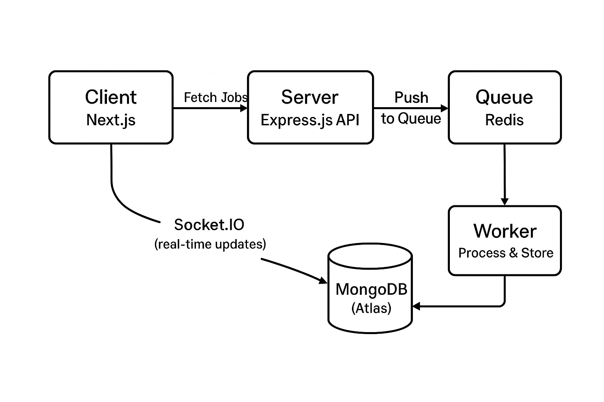

# 🧩 System Architecture — Scalable Job Importer

---

## 📘 Overview
The system imports jobs from multiple external APIs, queues them for processing, and provides a real-time UI to track progress and history.

---

## 🧱 Architecture Diagram

*(Use a Draw.io or Excalidraw diagram and export it as architecture-diagram.png)*

---

## ⚙️ Components

### 1️⃣ Frontend (Next.js)
- Displays job import progress and history.
- Connects to backend via REST + WebSockets.
- Uses Redux Toolkit for state management.

### 2️⃣ Backend (Express.js)
- Exposes REST APIs for triggering job imports.
- Uses MongoDB for storing job data.
- Queues tasks using Redis (BullMQ / Bull).
- Supports retry logic with exponential backoff.

### 3️⃣ Queue System (Redis + Worker)
- Each job import runs asynchronously in the worker.
- Failed jobs are retried with exponential delays.
- Configurable batch size and concurrency.

### 4️⃣ Real-Time Layer
- Uses Socket.IO to push live updates (e.g., job progress, completion).
- Client subscribes via WebSocket connection.

---

## ⚖️ Design Decisions
| Decision | Reason |
|-----------|--------|
| **Next.js + Tailwind CSS** | Simplifies responsive UI and deployment |
| **MongoDB Atlas** | Flexible schema for varying job data |
| **Redis Queue (BullMQ)** | Efficient distributed job handling |
| **Socket.IO** | Real-time feedback to users |
| **Retry & Backoff** | Prevents overloading APIs and ensures reliability |

---

## 🧮 Scalability Considerations
- Jobs are processed asynchronously with Redis.
- Worker processes can scale horizontally.
- Batch size and concurrency are environment-configurable.
- MongoDB + Redis hosted in the cloud (Atlas + Redis Cloud).

---

## 💡 Future Improvements
- Add authentication and user-specific job tracking.
- Implement caching for repeated job fetches.
- Integrate with CI/CD pipeline (GitHub Actions).
